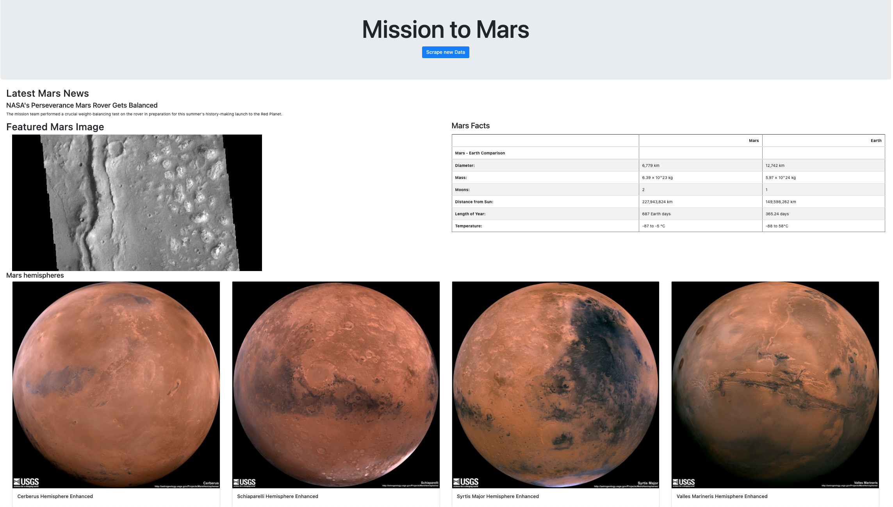

# web-scraping-challenge
In this project, information about mars was scraped from 3 different websites. Then a flask was used to display the scraped information on a single page. 

The data scraped is stored in a MongoDB, and then the data is retrieved from the MongoDB to display using HTML, Jinja, and Bootstrap in a chrome web browser.

This is a screenshot of the final flask app:

